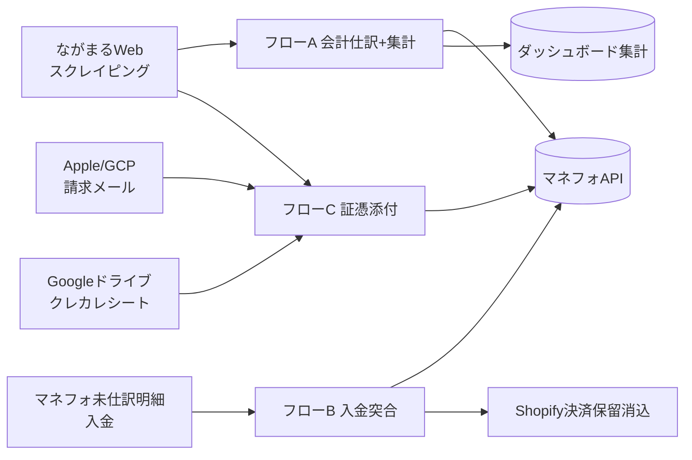

# 会計自動化設計書

*作成日: 2026-09-22*

## 背景・課題

入出金・証憑まわりの会計処理が3か所とも手作業で、量が増えるほど負担になっている。

- **JA精算書**：出荷先（JAごとに異なる紙/PDFフォーマット）を目視確認し、売上・経費（荷造り運賃など）を仕訳へ手入力している。桃・ネクタリン・すももは会計上は合算でよいが、ダッシュボード分析では品種ごとに分けたい。
- **入金仕訳**：銀行入金とShopify注文を目視で突合し、摘要欄に注文番号を手入力、Shopify側の決済保留も手動で消込している。
- **出金仕訳（証憑添付）**：2023年開始のインボイス制度対応で全ての経費仕訳に証憑添付が必須になったが、各サービスサイトや紙の請求書から証憑を人が集めて仕訳に手動添付し、摘要（例：「元肥」）も手入力している。

マネーフォワード クラウド会計API（V3、OAuth2.0）のAPI利用申請は完了済み（ID/シークレット取得済み、未登録）。本設計書では、この3領域をAPIと自動抽出（決定論的パース＋LLM）でどこまで自動化するかを整理する。

## 全体アーキテクチャ

3つの自動化フローは独立して動き、いずれもマネーフォワード クラウド会計APIに合流する。

| フロー | 起点 | 目的 | 自動化方針 |
| --- | --- | --- | --- |
| A: JA精算書ETL | ながまるWebスクレイピング（ながの農協分）/他出荷先PDF・画像 | 売上/経費仕訳 + 品種別集計 | 固定レイアウトは決定論的パース、スキャン画像は別途検討 |
| B: 入金突合 | マネフォの未仕訳入金明細 | Shopify注文との突合、摘要記入、決済保留消込 | 氏名＋金額の一致で確定、曖昧なものは候補提示 |
| C: 出金証憑添付 | メール/スクレイピング/Drive | 証憑取得と仕訳への添付、摘要自動入力 | 二段階抽出（構造化パース＋LLMによる分類） |

3フローとも「未仕訳の明細/注文を特定 → 証憑・情報を取得 → 仕訳作成または更新 → 証憑添付」という共通の骨格を持つ。

## フローA：JA精算書 → 会計仕訳 + ダッシュボード集計

取得元は、ながの農協分についてはながまるWebサービス（フローCの購買請求書と同じスクレイピング経路。他の出荷先は取得方法を別途確認）。入力はJA（出荷先）ごとに固定フォーマットの「園芸販売代金振込明細書（全体要約）」と「園芸販売代金精算書（伝票ごとの内訳）」の組。レイアウトは毎回同じなので、テキストPDFの場合は固定位置/正規表現パーサで必要値を確実に抽出できる（実際のサンプルで確認済み）。紙ベースのJAはスキャン画像になるため、OCR/画像読解LLM（Gemini想定）による抽出を組み合わせる。

伝票単位で抽出する項目：品種規格名、荷受日、①合計（税抜売上総額）、控除名ごとの金額（市場手数料・全農手数料・JA手数料・運営労務費・運営施設費・利用料・資材費・**運賃**・消費宣伝費など）、⑦差引貯金振込額（＝銀行入金額と一致）。

会計側はシンプルな二区分でよいことが確認済み（桃・ネクタリン・すももは区別不要）。

1. 全伝票の①を合算 → **売上高**
2. 全伝票の控除を合算 → **経費**（運賃は「荷造り運賃」として別科目分離、他は手数料系としてまとめてもよい）

銀行同期では差引貯金振込額（控除後の純額）だけが入金として自動取得されるため、仕訳は「売上（税抜相当）－経費各種（運賃は分離）＝入金額」の形でグロスアップして登録する必要がある。

ダッシュボード側は逆に品種規格名（川中島白桃・フアンタジアなど）で細かく集計する。PDF抽出層は伝票単位の構造化データを共通出力とし、会計ETLとダッシュボードETLの両方がこれを入力として使う。

## フローB：銀行入金 ⇔ Shopify注文の突合

確定後のアクションは2つのみ。①Shopify注文番号を仕訳の摘要欄末尾に追記、②Shopify側の決済保留を消込。難しいのは入金と注文を結びつける突合ロジックで、振込人名の入手しやすさによってパターンが分かれる。

| パターン | 氏名の入手 | 突合方法 |
| --- | --- | --- |
| 通常の銀行振込 | マネフォ明細に振込人名あり | 氏名（名寄せ）＋ 金額でShopify注文と直接突合 |
| ゆうちょ（氏名あり） | 明細に振込人名あり | 上に同じ |
| ゆうちょ（手書き伝票） | 明細にはなし、メールで手書き伝票画像が届く | 画像OCR（Gemini Vision想定）で氏名を抽出してから金額で突合 |
| B2B直接取引 | 事前登録の取引先情報で判断 | Shopify注文に存在しないので別途取引先マスタを候補ソースにする |

この四パターンを全自動で確定させるのは誤マッチリスクが高い。方針は【自信度の高いものだけ自動、残りは候補提示して人が確定】。

- **自動確定**：氏名・金額が1件に一意に一致する場合（上表の上2行）
- **候補提示（人が確定）**：手書き伝票OCRの結果、同金額・同日付付近が複数件ある場合、B2B取引

マネフォAPI側はGET `/api/v3/transactions` で `side=INCOME` の入金明細を定期取得する（明細は自動作成されるが仕訳は基本的に未仕訳のまま。UI上の勘定科目候補はサジェストでありAPIには含まれない）。突合確定後はGET `/api/v3/journals?transaction_ids=...` で既存仕訳の有無を一応確認し（人がすでに手動登録していた場合の重複防止）、**あれば** PUT `/api/v3/journals/{id}` で摘要にShopify注文番号を追記、**多くの場合は見つからないので** POST `/api/v3/transactions/journalize` で仕訳を新規作成しつつ `memo` に注文番号を記入する。

## フローC：出金証憑の取得・添付

対象ベンダは4つ。取得手段がそれぞれ違う。

| ベンダ | 証憑の入手方法 | 自動化方法 |
| --- | --- | --- |
| Apple | メール添付 | 定期メール監視で自動取得 |
| GCP | メール添付 | 定期メール監視で自動取得 |
| ながまるWebサービス（JA） | 2段階認証なしのポータル | スクレイピングで自動取得 |
| クレジットカード | 手元で撮影・Googleドライブに蓄積予定 | Driveフォルダ監視で自動取得 |
| Amazon（Amazon Business） | 証憑自動添付済み | 対象外 |

2段階認証付きのポータルはログイン自動化を避ける（認証突破やOTP代行入力は行わない方針）。対象外のサービスは所定の未取得証憑一覧を人に提示し、手動取得に委ねる。

なお、ながまるWebサービスは購買請求書だけでなく、フローAのながの農協分JA精算書の取得元でもある。スクレイピング機能は両フローで共用できる。

### 二段階抽出

この二段階は、実際の請求書PDF（ながの農協、平成形式固定）で確認済み。例として、肥料製品の請求書（BBながの果樹専用肥料、サンリード2号など）では、仕訳摘要の「元肥」はテキスト中のどこにも書かれておらず、品名リストからの分類判断が必要だった。

1. **第一段階（決定論的パース）**：請求書は帳票番号固定・レイアウト固定なので、品名・数量・単価・金額・請求合計額・振替予定日を正規表現/位置ベースで確実に抽出
2. **第二段階（LLM）**：抽出した品名リストをGeminiに渡し、摘要（例：元肥・追肥）と勘定科目（例：肥料費・農薬費）を推論

理由：画像/テキストから数値を読み取る作業はLLMが誤りやすく、固定フォーマットならパーサの方が確実。逆に「品名から会計分類を選ぶ」ような意味理解はLLMの得意分野。タスクを分けることで精度とコストの両方を改善できる。

さらに、同じ品名は毎回同じ摘要/勘定科目になる可能性が高いため、LLMが判定した「品名→摘要/勘定科目」をルックアップテーブルとして蓄積する。既知の品名はルックアップで即決し、未知の品名のみLLMに問う。

### 仕訳への紐付け

- **ながまる**：対応するJA普通預金口座の明細を `connected_account_id`（確認済み: `vjOmsrht1d+PSC/SFcltIw==`）かつ `connected_sub_account_id`（確認済み: `jVB/kDbCsSMOk6tEG6mk5Q==`。同じ`connected_account_id`内にJAカードの明細も混在するためsub_accountまで絞り込む必要がある）で絞り込み、金額・日付で突合（摘要は明細側にないため、抽出した摘要で上書き）
- **クレカ**：Googleドライブのフォルダを監視して新規レシート画像を取得。ファイル名の命名規則はあるが文字化け等で信頼性に欠けるため、ファイル名ではなく画像自体をOCR（Gemini Vision想定）で読み取り日付・金額・店名を抽出。それを使って対応カードの `connected_account_id` の明細と金額・日付で突合（JA精算書の二段階抽出と同じ発想で、第一段階の「決定論的パース」部分だけOCRに置き換わる形）
- **Apple/GCP**：取引内容の前方一致（`content_match_type=forward`）で候補を絞り込み、メール請求書と金額・日付で突合
  - Apple: `content="ＡＰＰＬＥ．ＣＯＭ／ＢＩＬＬ"`
  - GCP: `content="ＧＯＯＧＬＥ　＊ＣＬＯＵＤ"`（末尾のランダムコードは無視）

明細自体は銀行/カード連携で自動作成されるが、仕訳は基本的に未仕訳のまま（マネフォ画面上の勘定科目候補はUI上のサジェストにすぎず、APIレスポンスにも含まれない。「登録」ボタンを押すまで仕訳化されない）。そのため GET `/api/v3/journals?transaction_ids=...` で既存仕訳の有無を一応確認しつつ（人がすでに手動登録していた場合の重複防止）、**多くの場合は見つからない前提**で処理する。**見つかれば**その`journal_id`に PUT `/api/v3/journals/{id}` で摘要を更新し、POST `/api/v3/vouchers` で証憑を添付する。**見つからなければ**二段階抽出で導いた勘定科目・摘要で POST `/api/v3/transactions/journalize` により仕訳を新規作成し、そのまま POST `/api/v3/vouchers` で証憑を添付する。人に回すのは二段階抽出側の信頼度が低い場合（ルックアップテーブルにない未知の品名など）だけでよい。電帳法区分・タイムスタンプ・自動読み取りの指定オプションは詳細未確認（未確定事項を参照）。

## マネーフォワード クラウド会計API（V3）利用方針

認証はOAuth 2.0（認可コードフロー＋リフレッシュトークン）。トークン発行は `POST https://api.biz.moneyforward.com/token` で行い、取得したトークンは有効期限まで再利用し、401が返ってきたときだけ同エンドポイントでリフレッシュする（過度なトークン再発行は避ける）。`client_id`/`client_secret` の渡し方は連携アプリの「クライアント認証方式」設定に依存する（`CLIENT_SECRET_BASIC` はBasic認証、`CLIENT_SECRET_POST` はリクエストボディ）。**確認済み**：本アプリのクライアント認証方式は`CLIENT_SECRET_BASIC`。`expires_in`（アクセストークンの有効期限）は3600秒（1時間）。**重要**：実際にAPIを叩いて確認したところ、`refresh_token`はリフレッシュするたびに**ローテーション（新しい値に入れ替わる）することが確認された**。古い値を使い続けると次回のリフレッシュが`invalid_grant`（refresh token does not exist）で失敗する。**実装済み**：`packages/shared/src/moneyforward-token.ts`の`getMoneyForwardTokenAndPersist`がローテーションを検知して保存コールバックを呼び、`moneyforward-token-store.ts`がローカル`.env`書き戻し（実機確認済み）と本番Secret Manager書き戻し（コードは完成、Cloud Run JobのIAM権限付与は未実施）を提供。初回のみ人が認可コードフローでトークンを取得し、以降はパイプラインが自動で更新・保存を繰り返す（実機で連続2回の手動介入なし実行成功を確認済み）。`local/openapi.yaml` に会計APIの仕様書一式を配置済み。

| エンドポイント | 用途 | 使うフロー |
| --- | --- | --- |
| `GET /api/v3/transactions` | 連携サービスの明細一覧。`side`・`journalizing_statuses`・`content`(+`content_match_type`)・`connected_account_id`で絞り込み | B, C |
| `POST /api/v3/transactions/journalize` | 明細から仕訳を直接作成（`account_id`・`memo`・`remark`指定。明細はあっても仕訳は未登録なのが基本形なので、両フローともこれで新規作成する） | B, C |
| `POST /api/v3/journals` ／ `PUT /api/v3/journals/{id}` | 仕訳の新規作成・更新（`memo`は200文字上限） | A, B |
| `GET /api/v3/journals` ／ `GET /api/v3/journals/{id}` | 仕訳の検索・取得（`transaction_ids`で明細から逆引き可能） | A, B, C |
| `POST /api/v3/vouchers` | 証憑ファイル（base64）を`journal_id`付きで保存＝仕訳への添付が1回で完了。`journal_id`を含めればクラウド会計仕様に準拠して電帳法要件を自動で満たす（明示的な指定パラメータは不要）。制限：1仕訳最大5件・1回アップロード最大5件・1件5MB・名称255文字まで、アップロード後は完全削除不可 | A, C |
| `DELETE /api/v3/vouchers` | 仕訳と証憑の関連付けを解除 | C（誤添付時のリカバリ用） |
| `GET /api/v3/trade_partners` | 取引先マスタ取得 | B（B2B候補ソース） |
| `GET /api/v3/accounts` | 勘定科目一覧取得 | A, C（問合せ時の勘定科目・ID解決） |

共通注意点：

- `transactions`の`journalizing_statuses`には`none`（未仕訳）の他、`new_voucher_attached`（仕訳後に初回証憑が添付された）というステータスがあり、証憑未添付の仕訳済み明細を拾う際に使える
- 全APIが`429`（rate limit）を返す可能性があり、定期バッチ実行時はリトライ/バックオフを入れる
- `journals`の削除は不可逆なので（明細の仕訳化ステータスが`excluded`になる）、自動フローからは呼ばない方針とする

## 未確定事項・次のステップ

- [x] OAuthトークン取得・リフレッシュ処理の実装完了：`packages/shared/src/moneyforward-token.ts`（`refreshMoneyForwardToken`/`getMoneyForwardToken`）。Basic認証で`grant_type=refresh_token`をPOSTし、テスト（`tests/unit/moneyforward-token.test.ts`）も全件pass
- [x] `POST /api/v3/vouchers`の電子帳簿保存法対応確認完了：明示的な指定パラメータはなく、`journal_id`の有無で自動判別される（`journal_id`あり→クラウド会計仕様に準拠、なし→「電子取引データ保存」区分で別途画面入力が必要）。フローA/Cは常に`journal_id`を付与する設計なので対応不要。その他制限事項（1仕訳5件・1回アップロード5件・1件5MB・名称255文字・削除不可）も確認済み
- [x] ながまるWebサービスのログイン・スクレイピング実装完了：`packages/sync/src/nagamaru-client.ts`（Playwright使用、Auth0ログイン・販売精算書一覧・購買品請求書一覧・認証済みダウンロードを実機確認）。取得できる書類は「販売精算書（園芸）」「購買請求書」の2種類と確認済み。未対応：ページング（一度に最新20件のみ）、ほかの出荷先の証憑取得方法も引き続き確認
- [ ] JA精算書のスキャン画像パターン（出荷先ごとに異なる）のサンプル収集とOCR精度検証
- [ ] フローB（入金突合）で、同金額・同日付付近が複数件重なる頻度の実測（一意性リスクの定量化）
- [ ] B2B取引先マスタ（Shopify外）の保持場所を決める（マネフォの`trade_partners`を正とするか、別管理表か）
- [ ] 各フローとも自動確定と人の確認の境界線（例：金額一致のみで自動仕訳確定するか、常に人の最終確認を挟むか）を確定
- [ ] 着手順番（現在の合意：フローCから着手）に応じた実装タスク分解
- [ ] `packages/sync`のDockerfileはnode:20-slimでPlaywrightのブラウザ依存ライブラリがない。ながまるスクレイピングJobをCloud Run化する際は別Dockerfile（Playwright公式イメージベース等）が必要
- [ ] ながまるの一覧ページング対応（過去分を遡って取得する必要があるかを確認してから実装）
- [x] クレカレシート（Googleドライブ）のアクセス基盤完成：`packages/shared/src/google-drive.ts`で`sheets-reader`と同じなりすまし（Impersonated）パターンを使用し、Driveフォルダのファイル一覧取得（`listFilesInFolder`）とダウンロード（`downloadDriveFile`）を実装。新規サービスアカウント`drive-reader@pgfarm-dashboard-493812.iam.gserviceaccount.com`を作成し、経理フォルダ（Drive URL: `1Rbj4ZNi0J34QhhMNiSp0hMcm6Kc9pxQ-`）を閲覧者共有、呼び出し元（開発者アカウント）に`roles/iam.serviceAccountTokenCreator`を`drive-reader`リソース自体の権限ページ（プロジェクト全体のIAMページではない）で付与。Drive APIの有効化も実施。実機でテスト用JPEGの一覧取得・ダウンロードを確認済み（ファイルヘッダーがJPEGのマジックナンバー`ffd8ffe0`と一致）。残りはOCR（Gemini Vision）での日付・金額・店名抽出と、明細との突合ロジック
- [x] フローC（ながまる購買請求書）のエンドツーエンド連携確認完了：`packages/sync/src/nagamaru-invoice-journal-sync.ts`で一本のスクリプトに組み立てて実機確認。実データ20件で：1件はjournalizing_status=none（本当の未仕訳）を正しく検出しACCOUNT_LOOKUP未登録のため作成スキップ（設計通り）、14件は既存仕訳・証憑添付済みを正しく検出、5件（2023年分）は旧フォーマットでパース失敗し安全装置が正常に発動（データ欠損なし）。途中で**二重エンコードバグ**を発見・修正：マネフォAPIはレスポンス中のID群（id/transaction_id/account_id等）をあらかじめパーセントエンコード済みで返す仕様が判明し、`packages/shared/src/moneyforward-ids.ts`でデコードしてから返すように修正（リグレッションテスト追加済み）。残りはGemini分類と証憑添付（`POST /vouchers`ラッパー未実装）のみ
- [ ] 2023年以前の古いフォーマットの購買請求書PDFは現在の`parseNagamaruInvoiceText`でパース不可。過去分まで遡る必要があれば別パーサーが必要
- [x] **フローC（ながまる購買請求書）、エンドツーエンド完成**：Gemini分類（`packages/shared/src/gemini-classify.ts`、過去の実仕訳をfew-shot例として渡し、類似実例がなければ`matched:false`を返す設計）と証憑添付（`packages/shared/src/moneyforward-vouchers.ts`）を実装し、PDF取得→パース→明細特定→Gemini分類→仕訳新規作成→証憑添付を実機で通し確認済み。実際に未仕訳の1件（梱包資材・24,260円）を「荷造運賃・課仕10%」と正しく分類し、仕訳作成・証憑添付まで完了。remark（摘要）はGeminiではなく品目名を機械的に並べて作成（200文字超は安全に切り詰め）。もう1つバグを発見・修正：JSONリクエストボディにIDを埋め込む際は、クエリ文字列とは逆に**エンコード済みの形**で送る必要があることが判明（デコード済みの生の値を送ると`invalid_request_body_value`で拒否される）。`encodeMoneyForwardId`を`packages/shared/src/moneyforward-ids.ts`に追加し`journalizeTransaction`/`attachVouchers`に適用。Gemini APIの一時的な503（高負荷）に備えて指数バックオフリトライも実装済み。使用モデルは`gemini-3.6-flash`（`gemini-2.5-flash`は新規ユーザー向けに廃止済みだったため変更）
- [x] `connected_account.read`スコープがアプリの許可リストになく`GET /api/v3/connected_accounts`が403で使えないことを確認。アプリポータル上ではスコープ追加不可（変更できるのはクライアント認証方式のみ）。回避策として`GET /api/v3/transactions`（`transaction.read`は許可済み）のレスポンスに含まれるconnected_account_id/connected_sub_account_idを逆引きしてJA普通預金口座を特定済み（日本農業新聞の毎月自動引落と照合して確認）。今後もこのワークアラウンドで進める方針。なお`GET /api/v3/journals`は`start_date`/`end_date`が任意の366日以内ではなく、登録された会計期間（この事業者はカレンダー年、1月1日〜12月31日）に一致させる必要があることも判明
